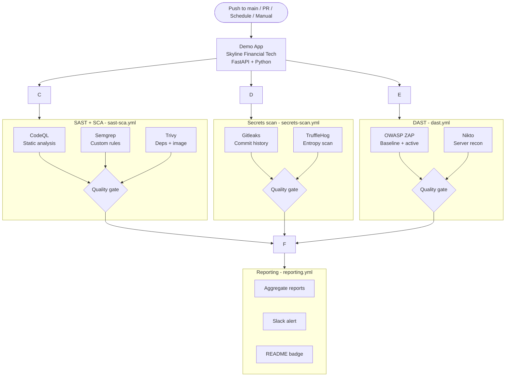

# Operation Aegis
### DevSecOps Capstone - Skyline Financial Tech

> A fully automated, end-to-end security pipeline built on GitHub Actions.
> Four layers of defence protecting a vulnerable demo banking API.


---

## Pipeline architecture



## Repo structure

```
operation-aegis/
.github/
    workflows/
        sast-sca.yml        # CodeQL + Semgrep + Trivy
        dast.yml            # OWASP ZAP + Nikto
        secrets-scan.yml    # Gitleaks + TruffleHog
        reporting.yml       # Aggregated reports + Slack
app/
    main.py                 # FastAPI demo app (intentionally vulnerable)
    requirements.txt        # Pinned deps - includes outdated packages
    Dockerfile              # Container image for scanning + DAST
tests/
    test_api.py             # Smoke tests (pytest)
docs/
    threat-model.md         # Architecture threat model
.zap/
    rules.tsv               # ZAP false positive suppressions
README.md
```

---

## Intentional vulnerabilities (learning targets)

| ID | Type | Location | Detected by |
|----|------|----------|-------------|
| VULN-001 | Hardcoded credentials | `app/main.py` L14-16 | Gitleaks, TruffleHog, Semgrep |
| VULN-002 | SQL injection | `GET /account/balance` | CodeQL, Semgrep |
| VULN-003 | Command injection | `GET /admin/ping` | CodeQL, Semgrep |
| VULN-004 | Broken authentication | `POST /transfer` | Semgrep, ZAP |
| VULN-005 | Sensitive data exposure | `GET /transaction/{id}` | Semgrep, ZAP |
| VULN-006 | Outdated dependency CVEs | `requirements.txt` | Trivy SCA |
| VULN-007 | Container runs as root | `Dockerfile` | Trivy, Checkov |
| VULN-008 | Debug mode in production | `Dockerfile` CMD | Trivy |

> **All vulnerabilities are intentional.** This repo exists to generate real
> scanner findings for the Operation Aegis write-up. The app runs only as an
> ephemeral container inside GitHub Actions during DAST scanning. It is never
> deployed to a live environment.

---

## Pipeline

| Workflow | File | Triggers | Tools |
|----------|------|----------|-------|
| SAST + SCA | `sast-sca.yml` | PR, push to main, schedule, manual | CodeQL, Semgrep, Trivy |
| DAST | `dast.yml` | Push to main, manual | OWASP ZAP, Nikto |
| Secrets scan | `secrets-scan.yml` | PR, push to main, schedule, manual | Gitleaks, TruffleHog |
| Reporting | `reporting.yml` | After workflows complete, manual | Aggregator, Slack |

---

## Required GitHub secrets

Add these in **Settings -> Secrets and variables -> Actions** before running workflows:

| Secret | Used by | Notes |
|--------|---------|-------|
| `SEMGREP_APP_TOKEN` | Semgrep | Free at semgrep.dev; enables dashboard |
| `SLACK_WEBHOOK_URL` | Reporting | Incoming webhook from your Slack workspace |

---

## Run locally

```bash
git clone https://github.com/Nisha318/operation-aegis.git
cd operation-aegis

cd app
pip install -r requirements.txt
uvicorn main:app --reload
```

Visit `http://localhost:8000/docs` for the Swagger UI.

```bash
cd ..
pip install pytest httpx
pytest tests/ -v
```

---

## Blog post

*Coming soon*

---

*DevSec Blueprint capstone - #DevSecBlueprint*
